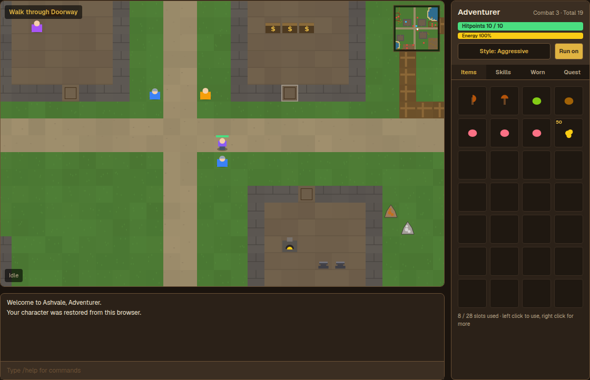
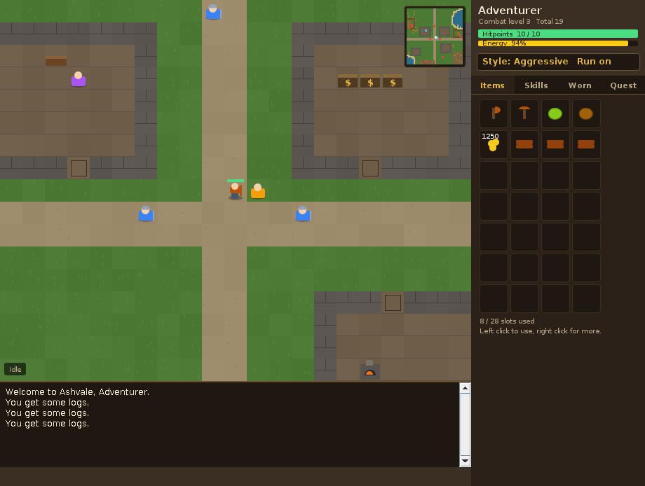
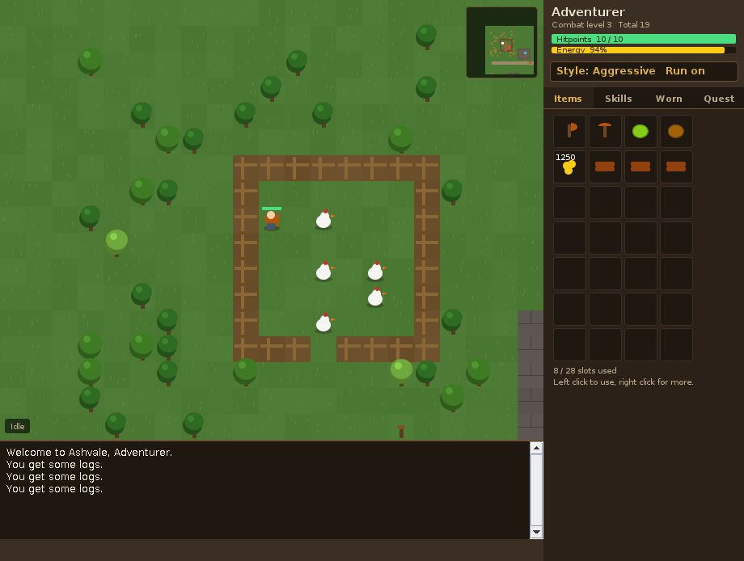

# Ashvale

A small RuneScape-inspired MMO-style RPG. Click to walk, train ten skills, bank your loot,
smith your own gear, fight the goblins in the south field and cook for the village feast.

It comes in two builds that play the same world:

- **In the browser** — a TypeScript port rendered on a canvas, served by the Next.js app in
  this repository at [`/game`](../src/app/game/page.tsx). Nothing to install.
- **On the desktop** — the original Java client in this folder. No build tool, no
  dependencies; a JDK 17 or newer is all it needs.

Both read the same map file, so the town, the mine and every tree sit in the same place.
`scripts/generate-map.mjs` regenerates the browser copy from the Java resource:

```bash
npm run game:map     # after editing game/src/main/resources/maps/ashvale.map
```

## The browser build

```bash
npm install
npm run dev          # then open http://localhost:3000/game
npm run test:game    # 115 engine checks, no browser needed
```

The engine (`src/game/`) is plain TypeScript with no framework imports: the same tick loop,
pathfinding, combat maths and crafting recipes as the Java build, exercised by a mirrored test
suite. Only the client differs — a canvas viewport plus React panels, with characters saved to
`localStorage` instead of a file.



## The desktop build



*The crossroads: bank booths behind the counter on the right, the general store on the left,
guards on patrol and Aldric waiting by the road.*



*The north-west forest and the chicken pen — where most characters spend their first hour.*

```bash
./run.sh                       # build if needed, then open the client
./test.sh                      # build and run the test suite
./run.sh --headless 400        # play a scripted session with no window
./run.sh --save mychar.save    # keep a character somewhere other than ~/.aetheria
```

Or without the scripts:

```bash
./build.sh
java -cp build/classes com.exjets.aetheria.Main
```

## Playing

| Input | Does |
| --- | --- |
| Left click | Walk, chop, mine, fish, attack or talk — whatever is under the cursor |
| Right click | Every option for that tile, creature or item |
| Backpack slot, left click | Eat food, wear equipment, otherwise start a "use with" |
| Backpack slot, right click | Eat, wear, light, use, drop, examine |
| `Esc` | Stop what you are doing |
| `R` | Toggle running |
| `Ctrl+S` / `Ctrl+L` | Save / load |
| Chat box | `/help /save /load /where /stop /run /style /quest` |

The game runs on a 600ms tick, the same beat as the games that inspired it: you walk one tile
per tick, two while running, and swing every four ticks.

### The world

Ashvale is a single 64x48 region with a crossroads at its centre.

- **Town** — bank booths, a general store, and Aldric the Cook by the road.
- **Smithy** (south-east of the crossroads) — a furnace for smelting and two anvils.
- **Forest** (north-west) — trees, oaks, and willows down by the pond.
- **Chicken pen and cow field** — safe, low level combat and a supply of raw food.
- **Mine** (south-east) — copper, tin, iron and coal.
- **Goblin camp** (south) — aggressive, and the best drops for a new character.
- **Lake** (north-east) — net fishing on the shore; rod fishing at the south-west pond.

### Skills

Attack, Strength, Defence and Hitpoints train through combat. Woodcutting, Mining, Fishing,
Cooking, Firemaking and Smithing train through gathering and crafting. Levels use the classic
experience curve, so level 99 is 13,034,431 experience away.

Progression works the way you would expect: mine copper and tin, smelt bronze bars at the
furnace, hammer them into gear at the anvil, and use that gear to fight things that drop
better loot. Fish and cook to keep yourself alive.

## How the desktop build is put together

```
game/src/main/java/com/exjets/aetheria/
  Main.java            entry point and command line options
  core/                skills, experience curve, items, inventory, bank, equipment, player
  world/               tiles, scenery, ground items, the map loader and A* pathfinding
  npc/                 creature definitions, drop tables and spawned instances
  combat/              attack styles and the melee formulas
  game/                the tick engine, player actions, recipes, shop and the quest
  save/                a readable key/value character file
  ui/                  Swing client: viewport, side panel, chatbox and dialogs
src/main/resources/maps/ashvale.map    the world, as two grids of symbols plus npc spawns
src/test/java/         a dependency free test suite and the offscreen screenshot tool
```

The browser port mirrors it:

```
src/game/
  core/ world/ npc/ combat/ engine/   the same model, ported to TypeScript
  ui/render.ts                        canvas drawing
  save.ts                             localStorage characters
  tests/run.ts                        the mirrored test suite
src/components/game/                  React client: canvas, panels, dialogs
src/app/game/page.tsx                 the /game route
```

The engine knows nothing about Swing. `GameEngine.tick()` advances the simulation and reports
back through a small `Listener` interface, which is why the same engine drives the window, the
`--headless` demo and the tests.

### The map file

`ashvale.map` is human editable. It holds a `[tiles]` grid (`.` grass, `~` water, `#` wall,
`_` road, `=` floor, `x` fence, `s` sand, `,` dirt), an `[objects]` grid of the same size
(`T` tree, `O` oak, `W` willow, `c`/`t`/`i`/`k` ore rocks, `f`/`F` fishing spots, `U` furnace,
`A` anvil, `B` bank booth, `R` range, `D` doorway) and an `[npcs]` list of
`x,y,kind,wanderRadius`. Scenery that would be unreachable or in the water is dropped at load
time, and the test suite asserts that every remaining resource and creature can be walked to.

### Combat maths

Both sides roll against each other's rating, and a landed hit rolls uniformly up to the
attacker's max hit:

```
rating   = (effective level + 8) * (equipment bonus + 64)
max hit  = floor(0.5 + (effective strength + 8) * (strength bonus + 64) / 640)
```

Attack style shifts three levels into Attack, Strength or Defence, or one into each on
Controlled, and decides which skill gets the four experience per point of damage.

## Testing

`./test.sh` runs the desktop suite's 116 checks covering the experience curve, inventory and bank rules, map
loading and reachability, pathfinding, the combat formulas, gathering, smelting, cooking,
kills and drops, death and respawn, shop prices, the quest and a save round trip. It needs no
display and exits non-zero on failure, so it drops straight into CI.

`ScreenshotTool` paints the client into a PNG without opening a window, which keeps the
renderer covered on headless machines:

```bash
java -cp build/classes com.exjets.aetheria.ScreenshotTool docs/screenshot.png 31,21
```

`npm run test:game` runs the browser port's 115 equivalents through the TypeScript engine.

## Saving

The desktop build stores characters at `~/.aetheria/character.save`; the browser build keeps
the same `key=value` text in `localStorage`. Both autosave every 250 ticks and on exit, and
both skip unknown items on load, so an old save still opens after the item list changes.
